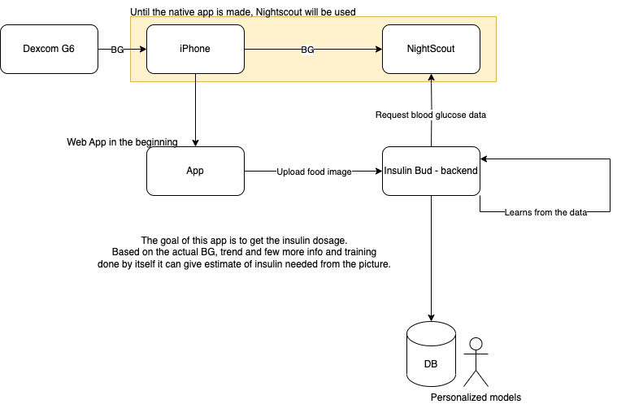

# TODO

- Setup NightScout API
    - Setup NightScout on an iPhone
- Setup a database
    - Data structure for the database
    - Syncing data from NightScout to the database
- Figure out where to save personalized models, how its actually compute/storage intensive?
- Setup a webserver


# The Insulin Bud
The Insulin Bud project is a project to help people with diabetes to calculate the amount of insulin they need to inject themselves with. This project is not ment to be used in a medical context. It is just a project to help me to experiment.

## High Level Architecture



# Python venv
## Create venv
```bash
python3 -m venv venv
```
## Activate venv
```bash
source venv/bin/activate
```
## Install requirements
```bash
pip install -r requirements.txt
```

## save requirements
```bash
pip freeze > requirements.txt
```